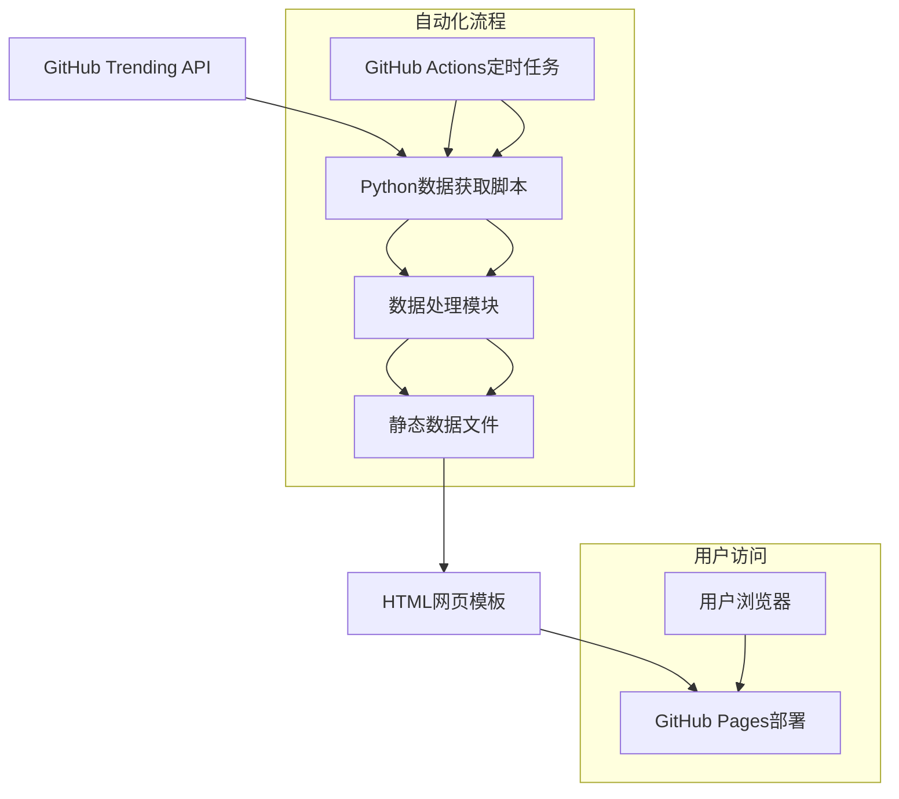
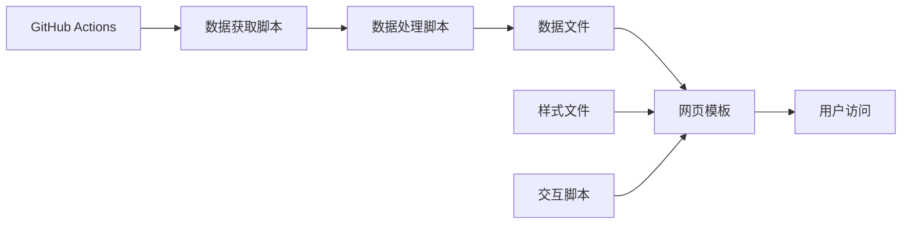
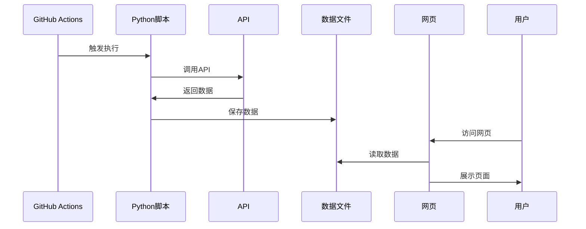

# 架构设计文档 - GitHub热榜网页项目

## 整体架构图

## 分层设计
### 数据层
- **数据源**：第三方GitHub trending API
- **数据格式**：JSON格式的项目数据
- **存储方式**：静态JSON文件

### 业务逻辑层
- **数据获取**：Python脚本调用API
- **数据处理**：数据清洗、格式化、筛选
- **数据更新**：定时任务自动执行

### 表现层
- **网页结构**：HTML5语义化标签
- **样式设计**：CSS3卡片式布局
- **交互功能**：JavaScript筛选功能

## 核心组件列表
1. **数据获取组件**：`scripts/fetch_trending.py`
2. **数据处理组件**：`scripts/process_data.py`
3. **网页模板组件**：`index.html`
4. **样式组件**：`styles/main.css`
5. **交互组件**：`scripts/app.js`
6. **自动化组件**：`.github/workflows/update.yml`

## 模块依赖关系图

## 接口契约
### 数据获取接口
**输入**：无参数
**输出**：JSON格式的热榜项目数据
**异常**：API调用失败、网络异常

### 数据处理接口
**输入**：原始API响应数据
**输出**：格式化后的项目数据数组
**异常**：数据格式错误、解析失败

### 网页展示接口
**输入**：格式化后的项目数据
**输出**：渲染后的HTML页面
**异常**：数据加载失败、模板错误

## 数据流向图

## 异常处理策略
### API调用异常
- 重试机制：最多重试3次
- 降级方案：使用缓存数据
- 日志记录：记录错误详情

### 数据处理异常
- 数据验证：检查必要字段
- 默认值处理：缺失字段使用默认值
- 错误隔离：单条数据错误不影响整体

### 部署异常
- 回滚机制：部署失败自动回滚
- 监控告警：部署状态监控
- 手动干预：支持手动触发部署

## 技术选型理由
1. **Python脚本**：API调用简单，数据处理能力强
2. **原生前端技术**：轻量级，部署简单，兼容性好
3. **GitHub平台集成**：无缝集成Actions和Pages，成本低
4. **卡片式布局**：用户体验好，信息展示清晰

## 性能优化策略
- 数据缓存：减少API调用次数
- 静态资源优化：CSS/JS压缩合并
- 懒加载：图片延迟加载
- CDN加速：利用GitHub Pages的CDN