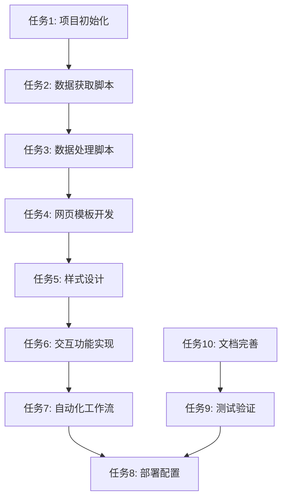

# 原子化任务文档 - GitHub热榜网页项目

## 任务依赖关系图

## 原子任务列表

### 任务1: 项目初始化
**输入契约**：
- 前置依赖：无
- 输入数据：项目需求文档
- 环境：本地开发环境

**输出契约**：
- 交付物：项目基础结构
- 验收标准：项目目录结构完整

**实现约束**：
- 技术栈：标准项目结构
- 接口：无
- 质量：符合项目规范

**依赖关系**：
- 后置：任务2
- 并行：无

---

### 任务2: 数据获取脚本
**输入契约**：
- 前置依赖：任务1完成
- 输入数据：API端点信息
- 环境：Python环境

**输出契约**：
- 交付物：`scripts/fetch_trending.py`
- 验收标准：能够成功获取GitHub热榜数据

**实现约束**：
- 技术栈：Python + requests库
- 接口：第三方GitHub trending API
- 质量：包含错误处理和重试机制

**依赖关系**：
- 后置：任务3
- 并行：无

---

### 任务3: 数据处理脚本
**输入契约**：
- 前置依赖：任务2完成
- 输入数据：原始API响应数据
- 环境：Python环境

**输出契约**：
- 交付物：`scripts/process_data.py`
- 验收标准：数据格式正确，包含必要字段

**实现约束**：
- 技术栈：Python + JSON处理
- 接口：数据清洗和格式化
- 质量：数据验证和错误处理

**依赖关系**：
- 后置：任务4
- 并行：无

---

### 任务4: 网页模板开发
**输入契约**：
- 前置依赖：任务3完成
- 输入数据：格式化后的项目数据
- 环境：HTML开发环境

**输出契约**：
- 交付物：`index.html`
- 验收标准：能够正确展示项目数据

**实现约束**：
- 技术栈：HTML5语义化标签
- 接口：数据绑定模板
- 质量：语义化、可访问性

**依赖关系**：
- 后置：任务5、任务6
- 并行：无

---

### 任务5: 样式设计
**输入契约**：
- 前置依赖：任务4完成
- 输入数据：网页结构
- 环境：CSS开发环境

**输出契约**：
- 交付物：`styles/main.css`
- 验收标准：卡片式布局，响应式设计

**实现约束**：
- 技术栈：CSS3 + Flexbox/Grid
- 接口：样式类定义
- 质量：现代美观、兼容性好

**依赖关系**：
- 后置：任务6
- 并行：无

---

### 任务6: 交互功能实现
**输入契约**：
- 前置依赖：任务4、任务5完成
- 输入数据：项目数据、样式定义
- 环境：JavaScript开发环境

**输出契约**：
- 交付物：`scripts/app.js`
- 验收标准：筛选功能正常工作

**实现约束**：
- 技术栈：原生JavaScript
- 接口：DOM操作和事件处理
- 质量：性能优化、错误处理

**依赖关系**：
- 后置：任务7
- 并行：无

---

### 任务7: 自动化工作流
**输入契约**：
- 前置依赖：任务2、任务3完成
- 输入数据：脚本文件
- 环境：GitHub Actions

**输出契约**：
- 交付物：`.github/workflows/update.yml`
- 验收标准：每周一凌晨自动执行

**实现约束**：
- 技术栈：GitHub Actions语法
- 接口：定时任务配置
- 质量：可靠执行、错误通知

**依赖关系**：
- 后置：任务8
- 并行：无

---

### 任务8: 部署配置
**输入契约**：
- 前置依赖：任务4、任务5、任务6完成
- 输入数据：网页文件
- 环境：GitHub Pages

**输出契约**：
- 交付物：GitHub Pages配置
- 验收标准：网页可正常访问

**实现约束**：
- 技术栈：GitHub Pages配置
- 接口：部署流程
- 质量：稳定部署、快速访问

**依赖关系**：
- 后置：任务9
- 并行：无

---

### 任务9: 测试验证
**输入契约**：
- 前置依赖：所有开发任务完成
- 输入数据：完整项目文件
- 环境：测试环境

**输出契约**：
- 交付物：测试报告
- 验收标准：所有功能正常

**实现约束**：
- 技术栈：手动测试 + 自动化检查
- 接口：功能验证
- 质量：全面覆盖、问题修复

**依赖关系**：
- 后置：任务10
- 并行：无

---

### 任务10: 文档完善
**输入契约**：
- 前置依赖：任务9完成
- 输入数据：项目文件、测试结果
- 环境：文档编辑环境

**输出契约**：
- 交付物：完整项目文档
- 验收标准：文档准确完整

**实现约束**：
- 技术栈：Markdown文档
- 接口：文档结构
- 质量：清晰易懂、维护性好

**依赖关系**：
- 后置：无
- 并行：无

## 复杂度评估
- 总复杂度：约1.5人日
- 单个任务复杂度：≤ 0.5人日
- 风险等级：低

## 质量门控
- [ ] 每个任务独立可验证
- [ ] 依赖关系无循环
- [ ] 验收标准具体可测
- [ ] 技术方案可行性已验证